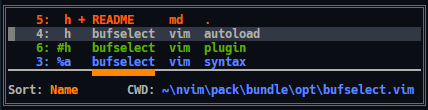
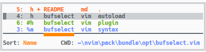
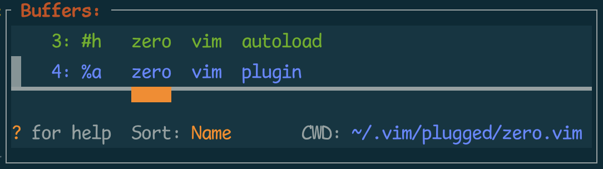

# BufSelect

## Summary

**BufSelect** is a minimalist buffer switcher plugin for Vim or Neovim. It was inspired by [bufexplorer](https://github.com/jlanzarotta/bufexplorer) and [buffergator](https://github.com/jeetsukumaran/vim-buffergator), but with some of their advanced functionality removed. What **BufSelect** ended up being is:

* A [single command](#command) to kick things off.
* A simple list in a floating window, showing the buffer number, filename, and relative path of all listed buffers. The list is generated each time **BufSelect** is displayed, thereby simplifying the code considerably.

    
    </br>**Figure 1**: BufSelect on a dark background

* A few [key mappings](#key-mappings) to open and delete buffers, sort the list, change working directory, and quickly move between buffers.
* Other settings define [sort order](#sort-order) and [custom highlighting](#custom-highlighting).

## Installation

Use your favorite plugin manager to install this plugin. [vim-pathogen](https://github.com/tpope/vim-pathogen), [Vundle.vim](https://github.com/VundleVim/Vundle.vim), [vim-plug](https://github.com/junegunn/vim-plug), [neobundle.vim](https://github.com/Shougo/neobundle.vim), and [Packer.nvim](https://github.com/wbthomason/packer.nvim) are some of the more popular ones. A lengthy discussion of these and other managers can be found on [vi.stackexchange.com](https://vi.stackexchange.com/questions/388/what-is-the-difference-between-the-vim-plugin-managers).

If you have no favorite, or want to manage your plugins without 3rd-party dependencies, I recommend using packages, as described in Greg Hurrell's excellent Youtube video: [Vim screencast #75: Plugin managers](https://www.youtube.com/watch?v=X2_R3uxDN6g)

## Compatibility

The `master` branch of this plugin is no longer compatible with Vim, and all new development will target Neovim. If you are using Vim 8+, you can still use this plugin; just checkout the `vim-compatible` branch.

## Command

The only command is **`:ShowBufferList`**, which can be assigned to a key. The mapping is not done by this plugin, so as not to interfere with your existing mappings. Here is how you would map the command:
```vim
nnoremap <silent> <leader>b :ShowBufferList<CR>
```

## Settings
### Key Mappings

These key mappings are used only within **BufSelect**. Some are configurable, while others are fixed.

#### Configurable
The mappings' corresponding variables and default values are shown here. Only the keys you want to change need to be included in your `.vimrc`. By default, preview mode mappings prepend the letter <kbd>g</kbd> to the corresponding non-preview mappings.
```vim
let g:BufSelectKeyOpen          = 'o'  " Open the buffer in the current window.
let g:BufSelectKeySplit         = 's'  " Open the buffer in a new horzontal split.
let g:BufSelectKeyVSplit        = 'v'  " Open the buffer in a new vertical split.
let g:BufSelectKeyTab           = 't'  " Open the buffer in a new tab.

let g:BufSelectKeyPreviewOpen   = 'go'  " Preview the buffer in the current window, keeping BufSelect open.
let g:BufSelectKeyPreviewSplit  = 'gs'  " Preview the buffer in a new horzontal split, keeping BufSelect open.
let g:BufSelectKeyPreviewVSplit = 'gv'  " Preview the buffer in a new vertical split, keeping BufSelect open.
let g:BufSelectKeyPreviewTab    = 'gt'  " Preview the buffer in a new tab, keeping BufSelect open.

let g:BufSelectKeyFind          = 'f'  " Find the buffer in any open window, and go there.
let g:BufSelectKeyDeleteBuffer  = 'x'  " Close the buffer using vim's bwipeout command.
let g:BufSelectKeySort          = 'S'  " Change the sort order.
let g:BufSelectKeyChDir         = 'cd' " Change working directory to match the buffer's.
let g:BufSelectKeyChDirUp       = '..' " Change working directory up one level from current.
let g:BufSelectKeySelectOpen    = '#'  " Move cursor to the next listed open buffer.
let g:BufSelectKeyExit          = 'q'  " Exit the buffer list.
```

#### Fixed
* <kbd>Enter</kbd> opens a buffer in the current window. It's the same as `g:BufSelectKeyOpen`.
* <kbd>Esc</kbd> exits the buffer list - the same as `g:BufSelectKeyExit`.
* <kbd>0</kbd>...<kbd>9</kbd> moves the cursor to the next buffer matching the cumulatively-typed buffer number.
* <kbd>?</kbd> show/hides short descriptions of these commands.

    
    </br>**Figure 2**: BufSelect on a light background, with help text visible

### Customize Float Window

Float window config can be customized with `g:BufSelectFloatWinConfig`. Default value:

```vim
let g:BufSelectFloatWinConfig = {}
```

For example, customize `title` and `border` for float window:

```vim
let g:BufSelectFloatWinConfig = { 'border': 'single', title: ' Buffers: ' }
```



For more for details, please check `:h nvim_open_win()`.

### Sort Order
The initial sort order can be set with this statement, which is showing the default value:
```vim
let g:BufSelectSortOrder = 'Name'
```
Valid values are `'Num'`, `'Status'`, `'Name'`, `'Extension'`, and `'Path'`.

`'Status'` refers to whether a buffer is loaded or visible. See `:help :ls`, which states:

* `a` an active buffer: it is loaded and visible
* `h` a hidden buffer: it is loaded, but currently not displayed in a window
* ` `(space) indicates a file that's been added (see `:help :badd`), but is not yet loaded.

### Custom Highlighting
The colors used in **BufSelect** were picked to work in both dark and light backgrounds, but they can be customized if desired, by overriding these highlight groups. To ensure correct timing, put your `highlight` statements in a file named `after/syntax/bufselect.vim` in your nvim config directory. The highlight groups are:

* `BufSelectSort` - the sort indicator
* `BufSelectCurrent` - the current buffer, indicated by a `%`, and the current working directory
* `BufSelectAlt` - the alternate buffer, indicated by a `#`
* `BufSelectUnsaved` - unsaved buffers, indicated by a `+`
* `BufSelectHelp` - the question mark in `? for help`
* `BufSelectKeys` - mapped keys in the help text

Float window highlight can be customized with `g:BufSelectFloatWinHighlight`. Default value:

```vim
let g:BufSelectFloatWinHighlight = ''
```

For example, use same background like normal buffer for some colorschemes that don't define `NormalFloat` highlight group:

```vim
let g:BufSelectFloatWinHighlight = 'NormalFloat:Normal'
```

For more details, please check `:h 'winhl'`
