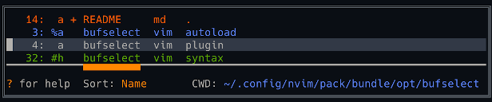

# BufSelect

## Summary

**BufSelect** is a minimalist buffer switcher plugin for Vim or Neovim. It was inspired by [bufexplorer](https://github.com/jlanzarotta/bufexplorer) and [buffergator](https://github.com/jeetsukumaran/vim-buffergator), but with some of their advanced functionality removed. What **BufSelect** ended up being is:

* A [single command](#command) to kick things off.
* A simple list in a floating window, showing the buffer number, filename, and relative path of all listed buffers. The list is generated each time **BufSelect** is displayed, thereby simplifying the code considerably.

    
    <br/>**Figure 1**: BufSelect on a dark background

* A few [key mappings](#key-mappings) to open and delete buffers, sort the list, change working directory, and quickly move between buffers.
* Other settings define [sort order](#sort-order) and [custom highlighting](#custom-highlighting).

## Installation

Use your favorite plugin manager. If you don't have one, try one of these: [vim-pathogen](https://github.com/tpope/vim-pathogen), [vim-plug](https://github.com/junegunn/vim-plug), [Packer.nvim](https://github.com/wbthomason/packer.nvim) or [lazy.nvim](https://github.com/folke/lazy.nvim). Alternatively, you can use packages and submodules, as Greg Hurrell ([@wincent](https://github.com/wincent)) describes in his excellent Youtube video: [Vim screencast #75: Plugin managers](https://www.youtube.com/watch?v=X2_R3uxDN6g)

## Compatibility

The `master` branch of this plugin is no longer compatible with Vim, and all new development will target Neovim. If you are using Vim 8+, you can still use this plugin without all the newer functionality; just checkout the `vim-compatible` branch.

## Command

The only command is **`:ShowBufferList`**, which can be assigned to a key. The mapping is not done by this plugin, so as not to interfere with your existing mappings. Here's an example of how you would map the command:
```vim
nnoremap <silent> <leader>b :ShowBufferList<CR>
```

## Settings

Settings for **BufSelect** formerly were specified by 15 separate variables. They now are deprecated in favor of a single dictionary variable named `g:BufSelectSetup`. Using any of the old variables still will work but will cause a warning to be displayed.

The structure of the dictionary follows. Only the settings you want to override need to be specified. All others will have the default value, which also is shown. The corresponding old variables are in the second column.

<table>
    <thead>
        <tr>
            <th>Settings</th><th>Corresponding Old Variable</th>
        </tr>
    </thead>
    <tbody>
        <tr>
            <td>
<pre>
let g:BufSelectSetup =
  \ {
    \ 'mappings': {
      \ 'open':    'o',
      \ 'split':   's',
      \ 'vsplit':  'v',
      \ 'tab':     't',
      \ 'gopen':   'go',
      \ 'gsplit':  'gs',
      \ 'gvsplit': 'gv',
      \ 'gtab':    'gt',
      \ 'exit':    'q',
      \ 'find':    'f',
      \ 'delete':  'x',
      \ 'sort':    'S',
      \ 'cd':      'cd',
      \ 'cdup':    '..',
      \ 'next':    '#'
    \ },
    \ 'sortOrder': 'Name',
    \ 'win': {
      \ 'config':  {'border': 'double'},
      \ 'hl':      ''
    \ }
  \ }
</pre>
            </td>
            <td>
<pre>
&nbsp;
&nbsp;
&nbsp;
g:BufSelectKeyOpen
g:BufSelectKeySplit
g:BufSelectKeyVSplit
g:BufSelectKeyTab
g:BufSelectKeyPreviewOpen
g:BufSelectKeyPreviewSplit
g:BufSelectKeyPreviewVSplit
g:BufSelectKeyPreviewTab
g:BufSelectKeyExit
g:BufSelectKeyFind
g:BufSelectKeyDeleteBuffer
g:BufSelectKeySort
g:BufSelectKeyChDir
g:BufSelectKeyChDirUp
g:BufSelectKeySelectOpen
&nbsp;
g:BufSelectSortOrder
&nbsp;
g:BufSelectFloatWinConfig
(This is new. No old variable.)
&nbsp;
&nbsp;
</pre>
            </td>
        </tr>
    </tbody>
</table>

### Key Mappings

The `'mappings'` dictionary defines the key mappings that work only within **BufSelect**. They perform the following functions:

Mapping | Function
---|---
`'open'`    | Open the buffer in the current window, meaning the one under the **BufSelect** floating window.
`'split'`   | Open the buffer in a new horzontal split.
`'vsplit'`  | Open the buffer in a new vertical split.
`'tab'`     | Open the buffer in a new tab.
|
`'gopen'`   | Preview the buffer in the current window, keeping **BufSelect** open.
`'gsplit'`  | Preview the buffer in a new horzontal split, keeping **BufSelect** open.
`'gvsplit'` | Preview the buffer in a new vertical split, keeping **BufSelect** open.
`'gtab'`    | Preview the buffer in a new tab, keeping **BufSelect** open.
|
`'find'`    | Find the buffer in any open window, and go there.
`'delete'`  | Close the buffer using vim's `bwipeout` command.
`'sort'`    | Change the sort order.
`'cd'`      | Change working directory to match the buffer's.
`'cdup'`    | Change working directory up one level from current.
`'next'`    | Move cursor to the next listed open buffer.
`'exit'`    | Exit the buffer list.

Other unconfigurable mappings are:

Mapping | Function
---|---
<kbd>Enter</kbd> | opens a buffer in the current window. It's the same as `'open'`.
<kbd>Esc</kbd> | exits the buffer list - the same as `'exit'`.
<kbd>0</kbd>...<kbd>9</kbd> | moves the cursor to the next buffer matching the cumulatively-typed buffer number.
<kbd>?</kbd> | shows/hides short descriptions of all mappings.


<br/>**Figure 2**: BufSelect on a light background, with help text visible

### Sort Order
The initial sort order is set by the `'sortOrder'` setting. Valid values are `'Num'`, `'Status'`, `'Name'`, `'Extension'`, and `'Path'`.

`'Status'` refers to whether a buffer is loaded or visible. See `:help :ls`, which states:

* `a` an active buffer: it is loaded and visible
* `h` a hidden buffer: it is loaded, but currently not displayed in a window
* ` `(space) indicates a file that's been added (see `:help :badd`), but is not yet loaded.

### Floating Window Customizations

The **BufSelect** floating window can be configured two different ways in the `'win'` dictionary.

1. `'win.config'` lets you change things like the border and title of the window, like so:

```vim
let g:BufSelectSetup = {'win': {'config': {'border': 'single', title: ' Buffers: '}}
```


<br/>**Figure 3**: BufSelect with a single border and a title

For more for details, please check `:help nvim_open_win()`.

2. `'win.hl'` provides a way to override highlighting. Check out `:help 'winhl'` to see how it works. If your colorscheme doesn't define `NormalFloat`, you can use this make it look like the normal background. It also works to link the **BufSelect** highlight groups to other highlight groups. Both examples are shown here:

```vim
let g:BufSelectSetup = {'win': {'hl': 'NormalFloat:Normal,BufSelectSort:Pmenu,BufSelectCurrent:Keyword'}}
```

The highlight groups defined for **BufSelect** are:

* `BufSelectSort` - the sort indicator
* `BufSelectCurrent` - the current buffer also indicated by a `%`, and the current working directory
* `BufSelectAlt` - the alternate buffer also indicated by a `#`
* `BufSelectUnsaved` - unsaved buffers also indicated by a `+`
* `BufSelectHelp` - the question mark in `? for help`
* `BufSelectKeys` - mapped keys in the help text
