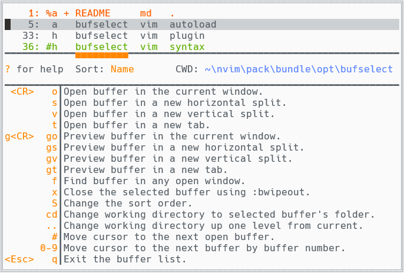

# BufSelect

## Summary

**BufSelect** is a minimalist buffer switcher plugin for Vim or Neovim. It was inspired by [bufexplorer](https://github.com/jlanzarotta/bufexplorer) and [buffergator](https://github.com/jeetsukumaran/vim-buffergator), but with some of their advanced functionality removed. What **BufSelect** ended up being is:

* A [single command](#command) to kick things off.
* A simple list in a floating window, showing the current working directory, and buffer number, filename, and relative path of all listed buffers.
    
    <br>**Figure 1**: BufSelect with a dark colorscheme

* A few [key mappings](#key-mappings) to open, find, or delete buffers, sort the list, change working directory, and quickly navigate the list.
* Other settings define [sort order](#sort-order) and [window customizations](#window-customizations).

## Installation

Use your favorite plugin manager. If you don't have one, try one of these: [vim-pathogen](https://github.com/tpope/vim-pathogen), [vim-plug](https://github.com/junegunn/vim-plug), [Packer.nvim](https://github.com/wbthomason/packer.nvim) or [lazy.nvim](https://github.com/folke/lazy.nvim). Alternatively, you can use packages and submodules, as Greg Hurrell ([@wincent](https://github.com/wincent)) describes in his excellent Youtube video: [Vim screencast #75: Plugin managers](https://www.youtube.com/watch?v=X2_R3uxDN6g)

## Compatibility

The `master` branch of this plugin is no longer compatible with Vim, and all new development will target Neovim. If you are using Vim 8+, you can still use this plugin without all the newer functionality; just checkout the `vim-compatible` branch.

## Command

The only command is **`:ShowBufferList`**, which can be assigned to a key. The mapping is not done by this plugin, so as not to interfere with your existing mappings. Here's an example of how you would map the command:
```vim
" vimscript
nnoremap <silent> <leader>b :ShowBufferList<CR>
```
```lua
-- lua
vim.api.nvim_set_keymap('n', '<leader>b', ':ShowBufferList<CR>', {noremap=true, slient=true})
```

## Settings

Settings for **BufSelect** are defined in a dictionary that is passed as a parameter to the `bufselect#settings` autoload function. The structure of the dictionary follows. Only the settings you want to override need to be specified. All others will use the default values, which are shown here.

```vim
{
  "mappings": {
    "open":    "o",
    "split":   "s",
    "vsplit":  "v",
    "tab":     "t",
    "gopen":   "go",
    "gsplit":  "gs",
    "gvsplit": "gv",
    "gtab":    "gt",
    "exit":    "q",
    "find":    "f",
    "delete":  "x",
    "sort":    "S",
    "cd":      "cd",
    "cdup":    "..",
    "next":    "#"
  },
  "sortOrder": "Name",
  "win": {
    "config": {"border": "double"},
    "hl":     ""
  }
}
```
Here is the syntax for calling the `bufselect#settings` function, from either vimscript or lua.
```vim
" vimscript
call bufselect#settings({
    \ "mappings": {"delete":"w", "open":"l", "gopen":"gl"},
    \ "win": {"config": {"border":"rounded", "title":"Buffers", "title_pos":"center"}}
\ })
```
```lua
-- lua
vim.fn['bufselect#settings']({
    mappings= {delete="w", open="l", gopen="gl"},
    win= {config= {border="rounded", title="Buffers", title_pos="center"}}
})
```

### Key Mappings

The `'mappings'` part of dictionary defines key mappings that work only within **BufSelect**. They perform the following functions:

| Dictionary Key | Function |
| :-: | --- |
| `"open"`    | Open the buffer in the current window, meaning the one under the **BufSelect** floating window. |
| `"split"`   | Open the buffer in a new horizontal split. |
| `"vsplit"`  | Open the buffer in a new vertical split. |
| `"tab"`     | Open the buffer in a new tab. |
| | |
| `"gopen"`   | Preview the buffer in the current window, keeping **BufSelect** open. |
| `"gsplit"`  | Preview the buffer in a new horizontal split, keeping **BufSelect** open. |
| `"gvsplit"` | Preview the buffer in a new vertical split, keeping **BufSelect** open. |
| `"gtab"`    | Preview the buffer in a new tab, keeping **BufSelect** open. |
| | |
| `"find"`    | Find the buffer in any open window, and go there. |
| `"delete"`  | Close the buffer using vim's `bwipeout` command. |
| `"sort"`    | Change the sort order. |
| `"cd"`      | Change working directory to match the buffer's. |
| `"cdup"`    | Change working directory up one level from current. |
| `"next"`    | Move cursor to the next listed open buffer. |
| `"exit"`    | Exit the buffer list. |

Some other mappings are non-configurable. They are:

| Mapping | Function |
| :-: | --- |
| <kbd>Enter</kbd> | opens a buffer in the current window. It's the same as `'open'`. |
| <kbd>Esc</kbd> | exits the buffer list - the same as `'exit'`. |
| <kbd>0</kbd>...<kbd>9</kbd> | moves the cursor to the next buffer matching the cumulatively-typed buffer number. See **Figure 2** below for illustration.<br>&nbsp;&nbsp;&nbsp;&nbsp;&nbsp;1. Typing <kbd>3</kbd> will search for and find buffer **33**, the next one starting with **3**.<br>&nbsp;&nbsp;&nbsp;&nbsp;&nbsp;2. Then typing <kbd>6</kbd> will search for and find buffer **36**.<br>&nbsp;&nbsp;&nbsp;3a. Then pressing <kbd>1</kbd> will look for buffer **361**.<br>&nbsp;&nbsp;&nbsp;3b. **361** doesn't exist, so drop the leading search digit and look for **61**.<br>&nbsp;&nbsp;&nbsp;3c. **61** doesn't exist either, so drop the **6** and look for buffer **1**, which does exist. The search is over. |
| <kbd>?</kbd> | shows/hides short descriptions of all mappings. |


<br>**Figure 2**: Using a light colorscheme, and showing the help text.

### Sort Order
The initial sort order is set by the `'sortOrder'` setting. Valid values are `'Num'`, `'Status'`, `'Name'`, `'Extension'`, and `'Path'`.

`'Status'` refers to whether a buffer is loaded or visible. See [:help :ls](https://neovim.io/doc/user/windows.html#%3Als), which states:

* `a` an active buffer: it is loaded and visible
* `h` a hidden buffer: it is loaded, but currently not displayed in a window
* ` `(space) indicates a file that's been added (see [:help :badd](https://neovim.io/doc/user/windows.html#%3Abadd)), but is not yet loaded.

### Window Customizations

The **BufSelect** floating window can be customized two different ways in the `'win'` dictionary, which contains these two items:

1. The `'config'` dictionary lets you change things like the border and title of the window. Check out [:help nvim_open_win()](https://neovim.io/doc/user/api.html#nvim_open_win()) for more for details. Example:

    ```vim
    " vimscript
    call bufselect#settings({'win': {'config': {'border':'single', 'title':'Buffers:'}}})
    ```
    ```lua
    -- lua
    vim.fn['bufselect#settings']({win= {config= {border='single', title='Buffers:'}}})
    ```

    
    <br>**Figure 3**: Custom Window Attributes: single border and a title

1. The `'hl'` string setting is used to override highlighting. Read [:help 'winhl'](https://neovim.io/doc/user/options.html#'winhl') to see how it works. For example, if your colorscheme doesn't define `NormalFloat`, you can use this to make it look like the normal background. It also works to link the **BufSelect** highlight groups to other highlight groups. Both scenarios are shown in this example:

    ```vim
    " vimscript
    call bufselect#settings({'win': {'hl': 'NormalFloat:Normal,BufSelectCurrent:Keyword'}})
    ```
    ```lua
    -- lua
    vim.fn['bufselect#settings']({win= {hl='NormalFloat:Normal,BufSelectCurrent:Keyword'}})
    ```

    The highlight groups defined for **BufSelect** are:

    * `BufSelectSort` - the sort indicator
    * `BufSelectCurrent` - the current buffer (also indicated by a `%`) and the current working directory
    * `BufSelectAlt` - the alternate buffer (also indicated by a `#`)
    * `BufSelectUnsaved` - unsaved buffers (also indicated by a `+`)
    * `BufSelectHelp` - the question mark in `? for help`, and the list of mapped keys in the help text
